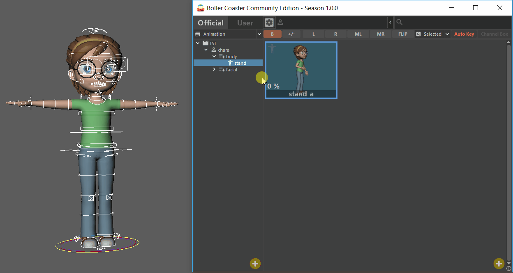
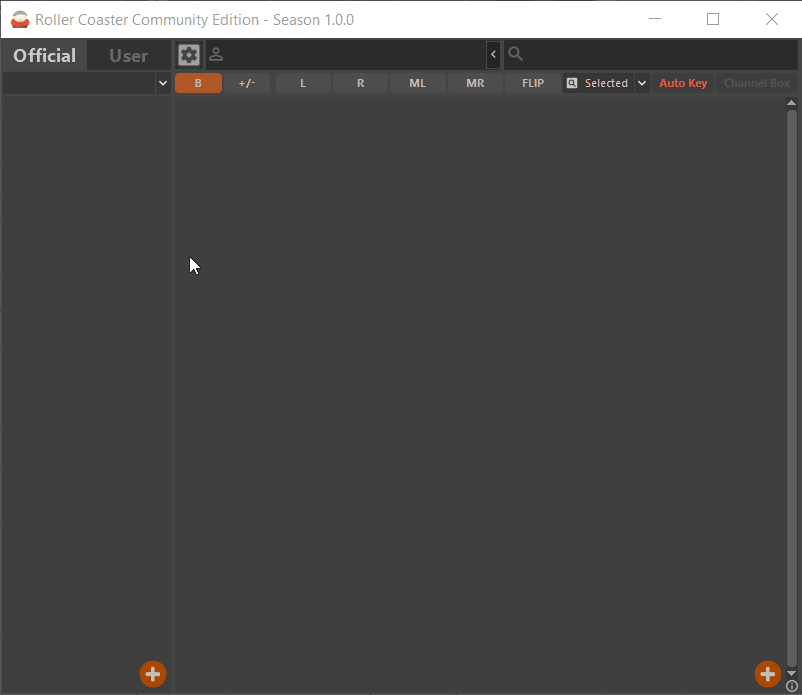
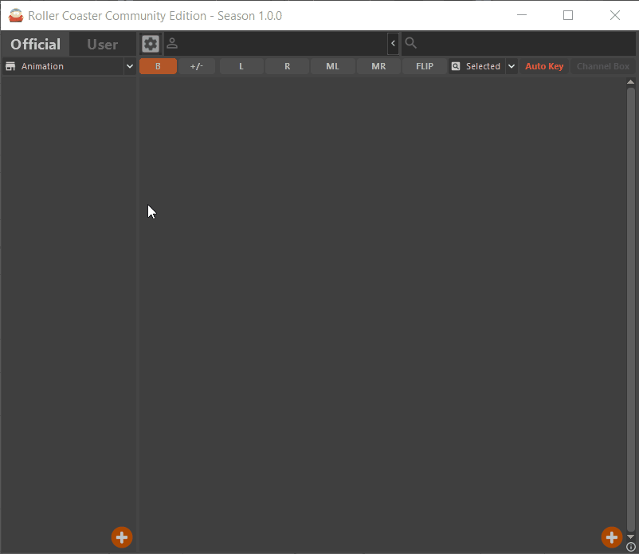
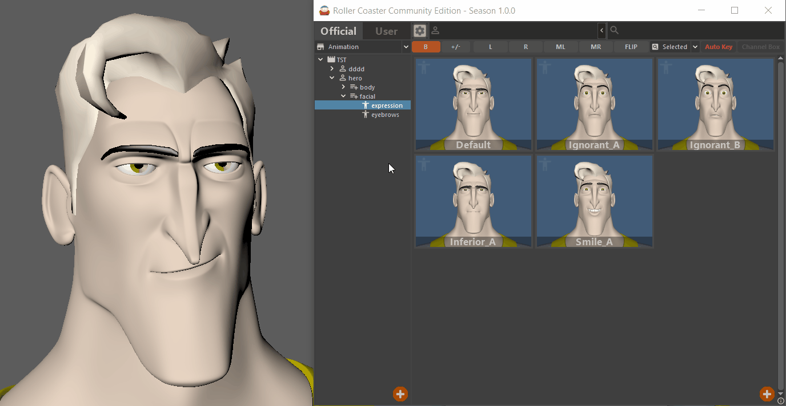
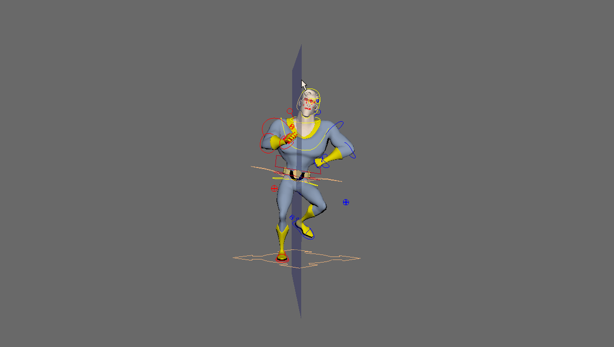

# maya-toolkit-roller-coaster
Maya toolkit used to save/load pose and motion-clip.




### FEATURE
- Save pose and motion-clip
- Copy/Paste pose and motion-clip
- Mirror/Flip pose
- Insert, merge and replace animation
- MMB drag for fast pose blending
- LMB drag and drop to organize items
- Custom rig context
- Marking menu for Maya
- Supports Windows, Linux
- Supports Maya 2016, 2017 and 2018


### DEPENDENCY
need to first install these two dependencies correctly.
- [QtSide](https://github.com/astips/QtSide)
- [MirrorPlane](https://github.com/astips/maya-plugin-mirror-plane).


### INSTALLATION
1. Download the latest release and unzip the folder where you want to live.
2. Copy folder "_rollercoaster_" into %USERPROFILE%/Documents/maya/scripts


### USAGE
need to value the _**QT_SIDE_BINDING**_ env-var before running the toolkit if you 
didn't set it up when maya launched.
```python
import os
os.environ['QT_SIDE_BINDING'] = 'pyside'  # Maya2016: pyside, Maya2017+: pyside2
```

- Startup Editor
```python
from rollercoaster.main import run_editor
run_editor()
```
- Startup Creator
```python
# startup pose creator
from rollercoaster.main import run_creator
run_creator('pose')

# startup clip creator
from rollercoaster.main import run_creator
run_creator('clip')
```
- Startup Context Maker
```python
from rollercoaster.main import run_context_maker
run_context_maker()
```
- Enable / Disable Hotkey  > Hotkey: **D + LMB**
```python
# enable hotkey
from rollercoaster.main import enable_hotkey
enable_hotkey()

# disable hotkey
from rollercoaster.main import disable_hotkey
disable_hotkey()
```

### PRESET > rollercoaster/presets.json
```json
{
    "manager": ["astips", "root"],
    "official": {
        "path": ""
    },
    "user": {
        "path": ""
    },
    "context": ["basic", "kayla", "hero"],
    "theme": ["black", "light-black", "grey", "light-grey"],
    "const": {
        "datafile": "data.xml",
        "snapshot": "snapshot",
        "compress": "jpg",
        "additive": ".ADDITIVE"
    },
    "template": {"image": "icon_about"},
    "email": "animator.well@gmail.com"
}
```
- "manager" -- super users of this toolkit (means who have permission on **Official Tab**)
- "context" -- x-rig context names configured by user
- "email" -- your register email used to auth professional version license


### CONTEXT
Because of the diversity of rigging files, **rollercoaster** allow users config their own
xrig & filter contexts.

- **XRIG Context Option** > rollercoaster/opt/xrig
_**Define rig's name-convention & axis-convention**_
for example : an open source rig file named 'kayla'
```python
from .base import XRigBase

class XRigContext(XRigBase):
    CONTEXT_NAME = 'kayla'
    
    CTRL_TAG = ['_CON']

    WEIGHT_CENTER_CTRL_TAG = ['_root_']
    
    LT_CTRL_TAG = ['L_']
    LT_CTRL_FORMAT = ['L_*']

    MD_CTRL_TAG = ['M_']
    MD_CTRL_FORMAT = ['M_*']

    RT_CTRL_TAG = ['R_']
    RT_CTRL_FORMAT = ['R_*']

    IK_CTRL_TAG = ['_ik']
    FK_CTRL_TAG = ['_fk']
    
    POLE_CTRL_TAG = ['_pole_']
    POLE_CTRL_FORMAT = ['*_pole_CON']
```

- **FILTER Context Option** > rollercoaster/opt/filter
_**Define maya objects selection filter._**
for example : an open source rig file named 'kayla', if you only want to deal with nurbscurves,
then you can define the filter module like this.
```python
from .base import FilterBase

class FilterContext(FilterBase):
    CONTEXT_NAME = 'kayla'
    
    def build(self):
        self.append(267)  # OpenMaya.MFn().kNurbsCurve
```

### SHORTCUTS
- **Alt + Q**                          _`Hide/Show Left Widget`_
- **Alt + W**                          _`Hide/Show Right Widget`_
- **Alt + E**                          _`Hide/Show Middle-Up Widget`_
- **Alt + R**                          _`Hide/Show Middle Option Widget`_
- **Alt + (1, 2, 3, 4, 5, 6)**         _`Auto Fit Size of Pose/Clip Items`_
- **Ctrl + Tab**                       _`Switch Official/User Tab`_
- **Ctrl + C**                         _`Copy Tree Item`_
- **Ctrl + X**                         _`Cut Tree Item`_
- **Ctrl + V**                         _`Paste Tree Item`_
- **Ctrl + Z**                         _`Undo Apply Pose`_
- **Ctrl + MMouse(Click/Wheel)**       _`Interactive Apply Pose`_
- **\`**                               _`Hide/Show Pose&Clip Label`_
- **Space**                            _`Switch Pose/Clip Snapshots`_ 
- **Delete**                           _`Delete Pose/Clip Item`_
- **Esc**                              _`Mini/Max Main Gui`_


### GIF IMAGES

- **Set Path**


- **Create Folder Tree**


- **Create Pose**


- **HotKey & MirrorPlane**




### ATTENTION !
- Login Name: Your workstation's login name should be in english with no space !
- Undo: Import Motion-Clip can't undo for now !
- Animation Layer: Import/Export Motion-Clip only support default animation layer for now !
- Community version has full features but quantitative restrictions, such as can only create 2 Shows.
 
 
### RELEASE INFO
[RELEASE INFO](rollercoaster/RELEASE.md)


### HAVING ISSUES?
Please send an email with the error message and a detailed step by step process of how you got the error.
Comments, suggestions and bug reports are welcome.  
